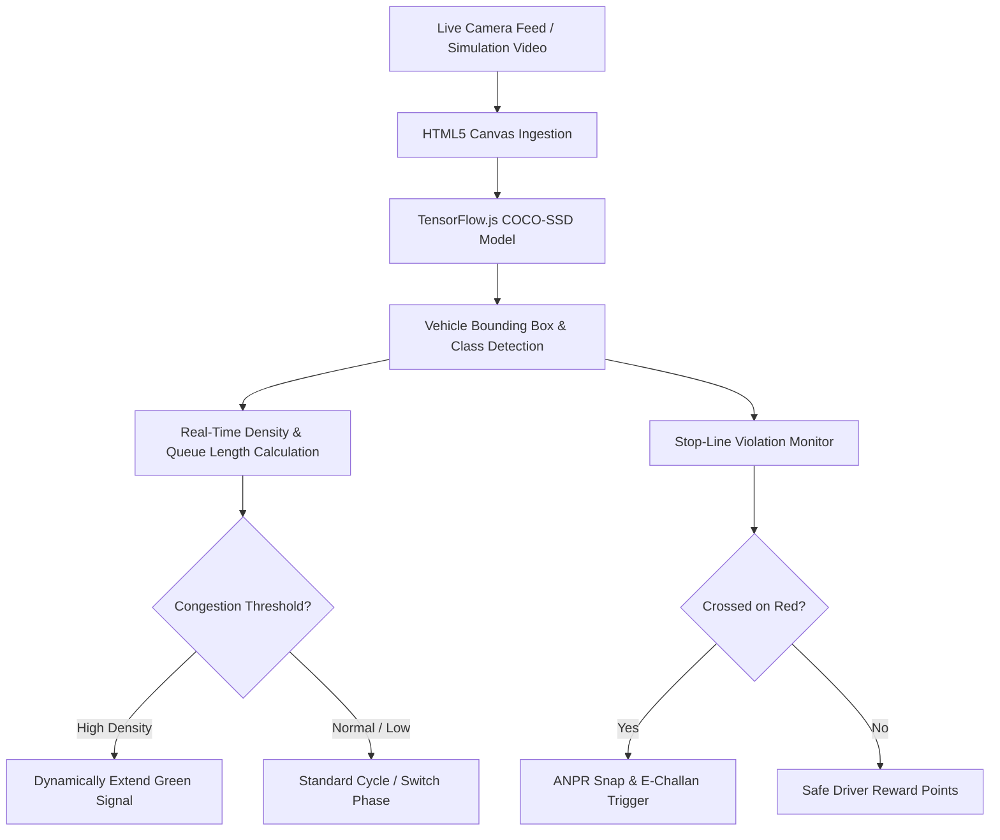

<div align="center">

# 🚦 Smart Traffic Management System for Urban Congestion

**AI-Powered Dynamic Traffic Light Control & Automated ANPR E-Challan Prototype**  
*(Developed for Smart India Hackathon - SIH Prototype)*

[](https://js.tensorflow.org)
[](https://github.com/tensorflow/tfjs-models/tree/master/coco-ssd)
[](https://tailwindcss.com)
[](https://developer.mozilla.org)
[](LICENSE)

<p align="center">
  A browser-based intelligent traffic management prototype that leverages <strong>TensorFlow.js</strong> and <strong>COCO-SSD</strong> to analyze real-time vehicle density from live camera feeds, dynamically adjust green-light timing to reduce urban bottleneck congestion, and detect red-light runners with an automated ANPR E-Challan system.
</p>

</div>

---

## 📌 Highlights & Problem Solved
Urban intersections typically run on static, hardcoded timers that fail during rush hours, causing massive congestion, wasted fuel, and high emissions.

This prototype provides an **edge-computed, client-side solution**:
* 🚗 **Zero Cloud Latency:** Entire computer vision and density estimation model executes directly inside the web browser via WebGL acceleration.
* ⏱️ **Adaptive Green Windows:** Dynamically extends green lights for congested lanes while minimizing idle red light waiting for empty lanes.
* 📸 **Automated ANPR & E-Challans:** Detects vehicles crossing stop lines on red signals and issues instant simulated E-Challans with license plate tracking.
* 🎁 **Safe Driving Incentives:** Gamified reward mechanism for commuters following speed limits and traffic decorum.

---

## 🏗️ Architecture & Pipeline



---

## ✨ Core Features

1. **Client-Side AI Object Detection**:
   - Uses pretrained `@tensorflow-models/coco-ssd` to detect cars, buses, trucks, and motorcycles in real-time.
2. **Adaptive Signal Algorithm**:
   - Calculates vehicle count and bounding box area coverage to dynamically allocate 15s to 60s signal windows.
3. **Interactive Simulation Dashboard**:
   - Multi-lane camera views with bounding box overlays, FPS counter, and lane congestion indices.
4. **ANPR & Violation Management**:
   - Logs red-light violations with timestamps, vehicle classification, and simulated challan receipts.
5. **Lightweight & Portable**:
   - 100% serverless frontend prototype — run on any device with a modern browser!

---

## 🚀 Quick Start / How to Run

Because the system runs completely client-side in the browser, no heavy backend installation is required!

### Option 1: Direct Browser Launch
Simply double-click **`traffic.html`** or right-click and choose **Open with Google Chrome / Microsoft Edge**.

### Option 2: Run via Local HTTP Server
```bash
# Clone the repository
git clone https://github.com/Ayush8512/Smart-traffic-management-System-for-Urban-Congestion-.git
cd Smart-traffic-management-System-for-Urban-Congestion-

# Start a quick Python web server
python -m http.server 8080
```
Open **`http://localhost:8080/traffic.html`** in your browser.

---

## 🛠️ Tech Stack
* **Deep Learning:** [TensorFlow.js](https://www.tensorflow.org/js), COCO-SSD Pretrained Object Detection
* **Frontend Framework:** Vanilla HTML5, Canvas API, JavaScript (ES6+)
* **Styling & UI:** [Tailwind CSS CDN](https://tailwindcss.com), Custom Dark Theme
* **Typography:** Google Inter Font

---

## 📄 License
This project is licensed under the **MIT License** - see the [LICENSE](LICENSE) file for details.

---

## 👤 Author
**Ayush Pandey**
- GitHub: [@Ayush8512](https://github.com/Ayush8512)
